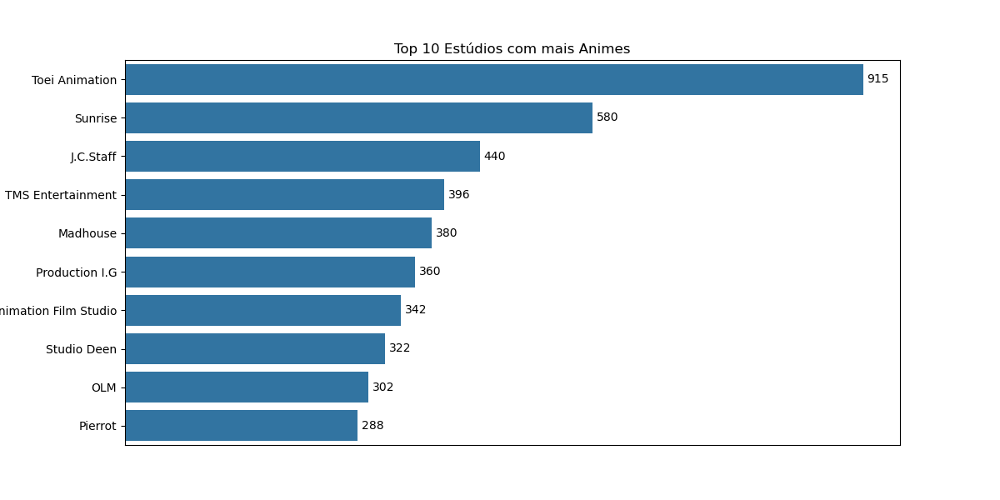
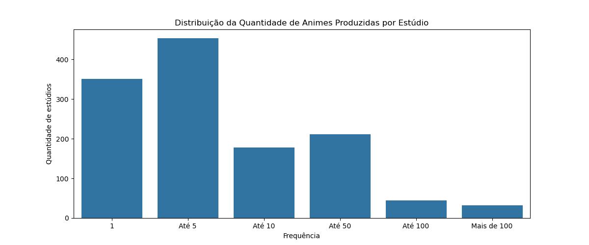
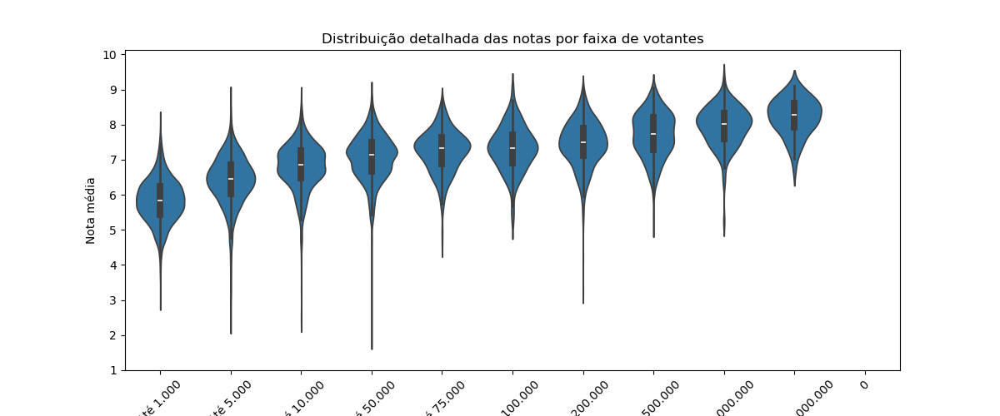
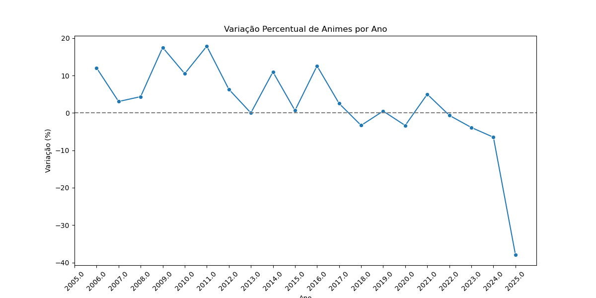

# Analise de Dados com Dados do MyAnimeList
Projeto de Análise de Dados com dados extraídos do MyAnimeList utilizando Python e Jupyter Notebook.
Este projeto é uma análise exploratória de dados utilizando o dataset de animes do MyAnimeList, com foco em entender padrões, distribuições e relações entre diferentes atributos dos animes.

## Notebooks
1. Pré-Processamento
   * Leitura do dataset.
   * Limpeza de dados: checagem de duplicatas, valores negativos, valores ausêntes e preenchimento de valores ausêntes.
   * Converão de tipos.
   * Criação de novos atributos.
3. Análise Exploratória
   * Exploração de variáveis: notas, popularidade, membros, número de pessoas que deram nota, número de episódios, demografia, temas, gêneros e estúdios
   * Criação de gráficos de distribuição, os mais populares, coocorrência de gêneros e outros.
   * Criação de matriz de correlação e coeficiente de pearson.
   * Visualização de histogramas, boxplots, countplots, gráfico de barras, gráfico de linha e heatmap
   * Insights sobre padrões.

## Dataset
[Dataset utilizado](https://www.kaggle.com/datasets/hamzaashfaque1999/myanimelist-scraped-data/) retirado do Kaggle.

O dataset de animes possui as seguintes colunas: 
* **id**: Identificador único atribuído pelo site.
* **link**: URL do registro.
* **title_name**: Título do registro.
* **score**: Média ponderada das notas dadas pelos usuários.
* **scored_by**: Número de pessoas que avaliaram o registro.
* **ranked**: Classificação do registro.
* **popularity**: Ranking de popularidade em comparação com outros shows, sendo 1º o mais popular, decidido pelo número de membros.
* **members**: Número de usuários que interagiram com o registro.
* **favorited**: Número de usuários que favoritaram o anime.
* **synonymns**: Outros títulos pelos quais o anime é conhecido.
* **japanese_name**: Nome em japonês.
* **english_name**: Nome em inglês.
* **german_name**: Nome em alemão.
* **french_name**: Nome em francês.
* **spanish_name**: Nome em espanhol.
* **item_type**: Indica se o item é uma série de TV, filme, OVA, ONA ou Especial.
* **episodes**: Número de episódios do registro. Alguns podem estar como "desconhecido".
* **status**: Indica se o anime está atualmente no ar, finalizado ou ainda não foi exibido.
* **airing_date**: Data em que o anime foi exibido.
* **premier_date**: Data de estreia do anime.
* **broadcast_date**: Dias em que o anime seria transmitido.
* **producers**: Partes responsáveis pela gestão da produção do anime.
* **licensors**: Partes responsáveis pela distribuição e licenciamento do anime.
* **studios**: Estúdios responsáveis pela produção da animação.
* **source**: Material original do qual o anime foi adaptado, como mangá, light novel etc.
* **genres**: Gêneros aos quais o anime pode ser categorizado.
* **themes**: Temas presentes no anime.
* **demographic**: Público-alvo ao qual o anime é direcionado.
* **duration**: Duração de um episódio.
* **age_rating**: Indica se o anime é classificado como G, PG, PG-13, R, Rx.
* **description**: Descrição do anime.
* **background**: Informações adicionais ou contexto do anime.

## Alguns Gráficos

Os insights restante dos gráficos podem ser encontrados nos notebooks e na pasta `graphs/`.
